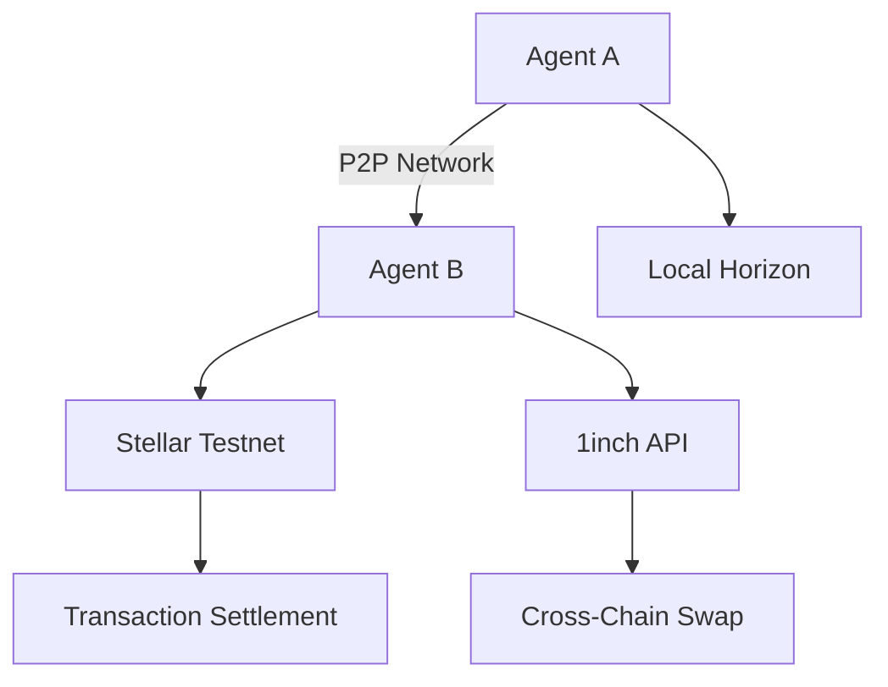
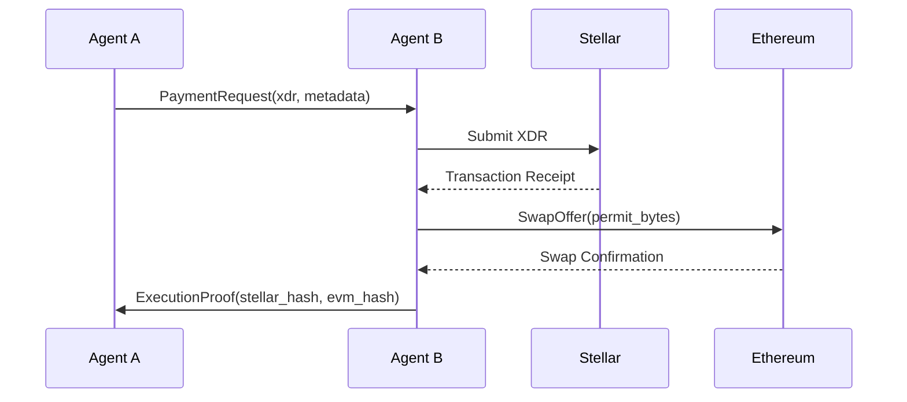

# py-libp2p-prototype

[](https://stellar.org)
[](https://libp2p.io)
[](https://python.org)

A peer-to-peer coordination network for Stellar applications using py-libp2p, enabling decentralized intent-based workflows like cross-chain swaps, trustline negotiations, and offchain voting.

## 🌟 Key Features

- **Decentralized Coordination**: Peer-to-peer messaging without centralized intermediaries
- **Intent-Based Workflows**: Structured protocol for payment requests, swaps, and governance
- **Cross-Chain Capabilities**: 1inch API integration for EVM ↔ Stellar swaps
- **Identity Linking**: Stellar account signatures tied to libp2p peer identities
- **Compliance-Ready**: Support for whitelists and verified credentials

## 🏗️ Architecture



## Configuration

Create a `.env` file in the project root with the following variables:

```ini
# Stellar Configuration
ISSUER_PUBLIC_KEY="..." # Stellar issuer account public key
ISSUER_SECRET_KEY="..." # Stellar issuer account secret key
RECEIVER_PUBLIC_KEY="..." # Stellar receiver account public key
RECEIVER_SECRET_KEY="..." # Stellar receiver account secret key

# Wallet conf
WALLET_ADDRESS= "..."
EVM_PRIVATE_KEY="..."
ASSET_CODE="..."

# 1inch conf
INCH_API_KEY="..."

# Infura conf
INFURA_KEY= "..."

# Ankr conf
ANKR_SEPOLIA_URL="..."
# Optional Advanced Settings
# STELLAR_NETWORK="TESTNET"  # Or "PUBLIC" for mainnet
# ETH_NODE_URL="https://sepolia.infura.io/v3/YOUR_KEY"
# GAS_LIMIT=300000
```

## 🛠️ Components
### 1. Stellar Asset Module
```python
from stellar_sdk import Server, TransactionBuilder

def create_asset_trustline():
    """Establish trustline for custom assets"""
    # Implementation details...
    pass

def lock_funds(receiver, amount, hashlock):
    """Create time-locked Stellar payment using pre-auth transactions"""
    # Uses Stellar's pre-auth transactions + time bounds
    pass
```
## 1inch Swap Module

### `generate_permit(token: str, amount: int) -> dict`
Generates EIP-712 compliant permit for 1inch swaps.

**Parameters:**
- `token`: ERC20 token contract address
- `amount`: Swap amount in smallest token units

**Returns:**
```python
{
    "permit_bytes": "0x...",  # Hex-encoded permit data
    "signature": "0x...",    # EIP-712 signature
    "deadline": 1234567890   # Expiration timestamp
}
```
## P2P Coordination Module

### Core Components
```python
class SwapCoordinator:
    def handle_intent(self, intent: Dict[str, Any]) -> bool
 ```

## 🔄 Swap Workflow

### Initiation Command
```bash
python initiate_swap.py \
  --from XLM \
  --to ETH \
  --amount 100 \
  --hashlock 0x... \
  --expiry 3600
```
## 📚 Usage Examples

### 1. Issue Stellar Asset
```bash
python issue_asset.py
```
### 2. Create Cross-Chain Swap
```bash
python wrap_eth_to_weth.py
```
### 3. Check Balances
```bash
python check_balance.py
```
### 4. Outputs
```bash
python generate_permit_bytes.py
```
### 5. Iinch
```bash
python create_fushion_order.py
```
## 🚀 Getting Started
## Prerequisites
- Python 3.10+
- Pipenv(recommended)
- Stellar Testnet account
 (https://lab.stellar.org/?$=network$id=testnet&label=Testnet&horizonUrl=https:////horizon-testnet.stellar.org&rpcUrl=https:////soroban-testnet.stellar.org&passphrase=Test%20SDF%20Network%20/;%20September%202015;;)

- 1inch API key

 (https://portal.1inch.dev/login)

## Installation

```bash
# Clone the repository
git clone https://github.com/your-repo/py_libp2p-prototype.git
cd py_libp2p-prototype.

# Install using poetry (recommended)
pipenv install

# Alternative: install using pip
pip install -r requirements.txt
```
## 🌐 Protocol Specification
## Message Types

| Type | Fields | Description |
|------|--------|-------------|
| `PaymentRequest` | `xdr`, `metadata`, `expiry` | Stellar payment intent with transaction envelope |
| `SwapOffer` | `from_asset`, `to_asset`, `amount`, `slippage` | Cross-chain swap proposal between Stellar and EVM chains |
| `TrustlineUpdate` | `asset`, `limit`, `authorized` | Trustline modification request |

## File Specifications

### `issue_asset.py`

```python
"""
Stellar Asset Issuance and Distribution Script

This script demonstrates a complete workflow for:
1. Creating a custom asset on the Stellar network
2. Establishing a trustline from a receiver account
3. Distributing the asset from issuer to receiver

Environment Variables Required:
- ISSUER_SECRET_KEY: Stellar issuer account secret key
- RECEIVER_SECRET_KEY: Stellar receiver account secret key
- ASSET_CODE: Custom asset code (3-12 characters)
"""

from stellar_sdk import Server, Keypair, TransactionBuilder, Network, Asset
from dotenv import load_dotenv
import os

# Load environment variables from .env file
load_dotenv()

# Initialize connection to Stellar testnet
server = Server("https://horizon-testnet.stellar.org")
network_passphrase = Network.TESTNET_NETWORK_PASSPHRASE

# Load keypairs from environment
- issuer_keypair = Keypair.from_secret(os.getenv("ISSUER_SECRET_KEY"))
- receiver_keypair = Keypair.from_secret(os.getenv("RECEIVER_SECRET_KEY"))
- asset_code = os.getenv("ASSET_CODE")
```
# Define the custom asset
```asset = Asset(code=asset_code, issuer=issuer_keypair.public_key)```

## Message Flow Sequence

This diagram shows the complete interaction flow between components:


### Agent A API Endpoints

| Endpoint | Method | Description | Parameters |
|----------|--------|-------------|------------|
| `/intent` | POST | Broadcast new intent | `xdr`, `metadata`, `signature` |
| `/discover` | GET | Discover peers | `timeout` (optional) |
| `/connect` | POST | Direct connect to peer | `peer_id`, `multiaddr` |

### Agent B API Endpoints

| Endpoint | Method | Description | Parameters |
|----------|--------|-------------|------------|
| `/process` | POST | Process incoming intent | `intent_data` |
| `/swap` | POST | Initiate cross-chain swap | `from_asset`, `to_asset`, `amount` |
| `/stellar/submit` | POST | Submit Stellar transaction | `xdr` |

## 🚀 Running the Network

### Start Agent B (Responder)
```bash
python agent_b.py
```
### Then Agent A (Initiator)
```bash
python agent_a.py
```